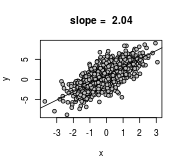

# Introduction

---

## Serial computation

- Traditionally, software has been written for serial computation

    * A problem is broken into a **discrete series** of instructions
    * Instructions are executed **sequentially** one after another on a **single processor**
    * Only one instruction may execute at any moment in time

\begin{center}
\includegraphics[width=0.65\textwidth]{Serial_computing.pdf}
\end{center}

<!--  -->

## Parallel computing

- Parallel computing is the **simultaneous use** of **multiple compute resources** to solve a computational problem

    * A problem is broken into **discrete parts** that can be **solved concurrently**
    * Each part is further broken down to a series of instructions which **execute simultaneously** on **different processors**
    * An **overall control/coordination** mechanism is employed 
\vspace{0.3cm}
\begin{center}
\includegraphics[width=0.6\textwidth]{Parallel_computing.pdf}
\end{center}

## Motivation for parallel computing

- Consider the case when you need to **repeat** a computation, or a series of computations, **many (many) times**, or/and when those individual computations are **time-consuming**, e.g.:
    * Running a simulation model using multiple different parameter sets,
    * Running multiple MCMC chains simultaneously,
    * Carrying out bootstrapping, cross-validation, etc.
    
    **It takes time...**

- Nowadays (almost) all computers have **multicore processors**

- As long as the computations do not need to communicate, they can be **spread across multiple cores** and **executed in parallel**, thus **reducing computation time**

# Parallel computing in R

---

## Parallel computing in R

- The package **`parallel`**
    * The **foundational package** for parallel computing in R
    * Comes pre-installed with base R in recent R versions (since R 2.14.0) 
    * Builds on `multicore` (works for unix-alikes) & `snow` (works for Winblows)
    * Provides **parallel `apply`** functions

- The package **`doParallel`**  is a parallel backend for the **`foreach`** package which enable the execution of **`for` loops** in parallel

- Some **task specific packages** include an option for parallel computation: e.g. `boot`, `caret`, `pls`, `plyr`

## How many cores do you have on your computer?


```r
library(parallel)
detectCores()
```

```
## [1] 8
```

## Create a parallel backend

You need to create a cluster with desired number of cores


```r
cl <- makeCluster(2)
```

## Execute computation in parallel using parallel `apply` functions


```r
parLapply(cl, X, FUN, ...)
parSapply(cl, X, FUN, ...)
parApply(cl, X, MARGIN, FUN, ...)
```


## Execute computation in parallel using `foreach`

Don't forget to:

    * load the `doParallel` package
    * register your cluster before the computations


```r
library(doParallel)
registerDoParallel(cl)
x <- foreach(..., .combine) %dopar% {
}
```

## Stop your cluster

In any case don't forget to stop your cluster when you're done


```r
stopCluster(cl)
```

# Exercises

---

## Exercise 1 Column means of a large matrix

Consider a matrix of 10 rows $\times$ 1 million columns with normally distributed data of mean 0 and variance 1

- Generate this matrix
- Compute the column means using `apply`, `parApply` and `colMeans`
- Record and compare the computation times

## One solution

\footnotesize


```r
mymat <- matrix(rnorm(10*1000000), nrow = 10, ncol = 1000000)
system.time(out <- apply(mymat, 2, mean))
```

```
##    user  system elapsed 
##   5.264   0.004   5.271
```

```r
library(parallel)
cl <- makeCluster(4)
system.time(out <- parApply(cl, mymat, 2, mean))
```

```
##    user  system elapsed 
##   2.716   0.068   4.468
```

```r
system.time(out <- colMeans(mymat))
```

```
##    user  system elapsed 
##   0.008   0.000   0.009
```


## Exercise 2 Bootstrap confidence interval of a regression slope

You're interested in computing a 95% confidence interval of the slope of the following regression


```r
x <- rnorm(n = 1000, mean = 0, sd = 1)
y <- rnorm(n = 1000, mean = 1 + 2 * x, sd = 2)
mydata <- data.frame(x, y)
myreg <- lm(y ~ x, data = mydata)
```

## Exercise 2 Bootstrap confidence interval of a regression slope

\small


```r
par(mar = c(4, 4, 4, 1), cex = 0.7)
plot(mydata, pch = 21, bg = "grey",
     main = paste("slope = ", round(myreg$coef[2], 2)))
abline(myreg)
```



## Exercise 2 Bootstrap confidence interval of a regression slope

- Reproduce the dataset, the regression and the graph

- Generate 1000 boostrap samples (function `sample()`)

- Compute the regression slope within each bootsrap sample

- Use the `quantile()` function to get a 95% confidence interval

- Do the analysis both in serial and parallel

- Record and compare the computation times


## `for` loop solution

\footnotesize


```r
a <- proc.time()
boot_a <- rep(NA, 1000)
for(i in 1:1000) {
  bootstrap_data <- mydata[sample(nrow(mydata), nrow(mydata),
                                  replace=TRUE), ]
  boot_a[i] <- unname(lm(y ~ x,bootstrap_data)$coef[2])
}
c(quantile(boot_a, c(0.025, 0.975)))
```

```
##   2.5%  97.5% 
## 1.9238 2.1687
```

```r
proc.time() - a
```

```
##    user  system elapsed 
##   1.340   0.016   1.355
```


## `foreach` loop solution

\scriptsize


```r
library(doParallel)
cl <- makeCluster(4)
registerDoParallel(cl = cl)
```


```r
a <- proc.time()
boot_b <- foreach(i = 1:1000, .combine=c) %dopar% {
  bootstrap_data <- mydata[sample(nrow(mydata), nrow(mydata),
                                  replace=TRUE), ]
  unname(lm(y ~ x, bootstrap_data)$coef[2])
}
stopCluster(cl)
c(quantile(boot_b, c(0.025, 0.975)))
```

```
##   2.5%  97.5% 
## 1.9179 2.1748
```

```r
proc.time() - a
```

```
##    user  system elapsed 
##   0.324   0.044   0.934
```

## `boot` solution

\scriptsize


```r
library(boot)
a <- proc.time()
get.slope.reg <- function(formula, data, indices){
  d <- data[indices,]
  unname(lm(formula, d)$coef[2])
}
boot_c <- boot(data = mydata, statistic = get.slope.reg, R = 1000,
               formula = y ~ x, parallel =  "multicore", ncpus = 4)
proc.time()-a
```

```
##    user  system elapsed 
##   1.820   0.428   0.580
```

## `boot` solution

\scriptsize


```r
boot.ci(boot_c, type = "perc")
```

```
## BOOTSTRAP CONFIDENCE INTERVAL CALCULATIONS
## Based on 1000 bootstrap replicates
## 
## CALL : 
## boot.ci(boot.out = boot_c, type = "perc")
## 
## Intervals : 
## Level     Percentile     
## 95%   ( 1.925,  2.166 )  
## Calculations and Intervals on Original Scale
```

## Exercise 3 Predicted Residual Sum of Squares (PRESS)

The PRESS is a statistic used to assess the predictive ability of a model : $\operatorname{PRESS} =\sum_{i=1}^n (y_i - \hat{y}_{i, -i})^2$ (Allen, 1971)

$\Leftrightarrow$ the prediction residual sum of squares within a leave-one-out cross-validation.

- Consider the regression from exercise 2, can you compute it's PRESS?

- Use both `for` and `foreach` loops for the computations and compare the corresponding execution times

- How fast is your code in comparison to the function `PRESS` of the `MPV` library?

## `for` loop solution

\footnotesize


```r
a <- proc.time()
pred <- rep(NA, nrow(mydata))
for (i in 1:nrow(mydata)){
  dat <- mydata[- i, ]
  mod <- lm(y ~ x, data = dat)
  pred[i] <- predict(object = mod, mydata[i, ])
}
sum((pred - mydata$y)^2)
```

```
## [1] 3849.3
```

```r
proc.time() - a
```

```
##    user  system elapsed 
##   1.788   0.004   1.792
```

## `foreach` loop solution

\scriptsize


```r
library(doParallel)
cl <- makeCluster(4)
registerDoParallel(cl = cl)
```


```r
a <- proc.time()
pred <- foreach(i = 1:nrow(mydata), .combine = c) %dopar% {
  dat <- mydata[- i, ]
  mod <- lm(y ~ x, data = dat)
  predict(object = mod, mydata[i, ])
}
stopCluster(cl)
sum((pred - mydata$y)^2)
```

```
## [1] 3849.3
```

```r
proc.time() - a
```

```
##    user  system elapsed 
##   0.332   0.052   0.973
```

## `PRESS` function from `MPV` package


```r
library(MPV)
a <- proc.time()
myreg <- lm(y ~ x, data = mydata)
PRESS(myreg)
```

```
## [1] 3849.3
```

```r
proc.time() - a
```

```
##    user  system elapsed 
##   0.008   0.000   0.008
```

# References

---
\small

- **Blaise Barney**. *Introduction to Parallel Computing* (2016). https://computing.llnl.gov/tutorials/parallel_comp/

- **Clint Leach**. *Introduction to parallel computing in R* (2014). http://michaeljkoontz.weebly.com/uploads/1/9/9/4/19940979/parallel.pdf

- **Steve Weston & Rich Calaway**. *Getting Started with doParallel and foreach* (2015). https://cran.r-project.org/web/packages/doParallel/vignettes/gettingstartedParallel.pdf

- **Dirk Eddelbuettel**. *CRAN Task View: High-Performance and Parallel Computing with R* (2016). https://cran.r-project.org/web/views/HighPerformanceComputing.html

- **Roger D Peng**. *R Programming for Data Science* (2016). https://bookdown.org/rdpeng/rprogdatascience/

- **Colin Gillespie & Robin Lovelace**. *Efficient R programming* (2016). https://bookdown.org/csgillespie/efficientR/

